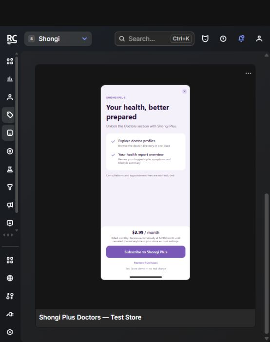

# Shongi

A personal health and beauty tracker built with Flutter. Shongi follows the real daily
routine of managing cyclical health alongside skin and hair, rather than being a generic
tracker with a long feature list.

<p align="center">
  
</p>

## What it does

**Free — the core loop is never paywalled:**

- **Period tracking** — cycle and period logging
- **Daily logs** — record what actually happened each day
- **Care plans** — structured multi-step plans
- **Insights** and **Statistics** — trends and charts over time
- **Skincare** and **Haircare** routines
- **Notifications** — local reminders, including weekly log reminders
- **Profile** — per-user account and subscription management

**Shongi Plus (subscription) — the professional layer:**

- **Doctor directory**
- **Doctor profile sheets**
- **Appointment booking**

The locked sections stay visible and clearly marked before purchase, so the paywall
answers "what would I get" instead of presenting a surprise.

## Tech stack

| Layer | Choice |
|---|---|
| Framework | Flutter (Dart SDK `^3.10.4`) |
| Auth | Firebase Authentication |
| Database | Cloud Firestore (per-user data, secured by `firestore.rules`) |
| Payments | RevenueCat `purchases_flutter` + `purchases_ui_flutter` `^10.13.2` |
| Charts | `fl_chart` |
| Notifications | `flutter_local_notifications` |
| Fonts / intl | `google_fonts`, `intl` |
| Media / links | `youtube_player_flutter`, `url_launcher` |

## Monetization

One freemium subscription — **Shongi Plus** — gating the `shongi_plus` entitlement.
The Firebase UID is used as the RevenueCat App User ID, so entitlement follows the user
across reinstalls instead of resetting on a new device. Restore purchases and Customer
Center are available in Profile.

No health records are sent to RevenueCat. The SDK only receives an anonymous app user ID
and an entitlement status.

Full design notes, dashboard configuration, identity handling and the production
checklist: **[docs/revenuecat.md](docs/revenuecat.md)**.

### Current status — please read

This project is **not yet published** to the App Store or Google Play, and purchases
currently run against **RevenueCat's Test Store**. The $2.99/month price is a development
placeholder, not a final pricing decision, and no production store product is connected
yet. Web and desktop builds show an unavailable state and do not grant premium access.

The premium gate is a **client-side UI check**. If doctor data or appointment writes ever
need protection against a modified client, that requires RevenueCat webhook/API
verification plus Firestore rules and server-side enforcement. This is listed in the
production checklist in `docs/revenuecat.md`.

## Running it

Normal Android/iOS `flutter run` builds pick up the public Test Store SDK key
automatically — no special launch arguments needed. Release builds never use that
fallback and reject test keys placed in production fields.

```sh
flutter pub get
flutter run
```

To use your own keys, copy the example config and fill in the **public** SDK key from
RevenueCat → API keys:

```sh
cp config/revenuecat.example.json config/revenuecat.local.json
# then edit config/revenuecat.local.json
flutter run --dart-define-from-file=config/revenuecat.local.json
```

`config/revenuecat.local.json` is git-ignored. **Never place a secret API key in it.**

The **Shongi (RevenueCat Test Store)** VS Code configuration supports these local key
overrides.

## Tests

```sh
flutter test test/subscription_service_test.dart
```

The suite covers the configuration and entitlement logic: debug key fallback, release key
isolation, unsupported platforms, identity isolation between accounts, late purchase
results, dismissal, restore, expiration, retry, and protected rendering.

## Project layout

```
lib/
  features/        auth, care_plan, dashboard, dev_tools, doctors, haircare, health,
                   insights, logs, notifications, onboarding, periods, profile,
                   skincare, statistics, subscriptions
  core/            shared core logic
  shared/          shared widgets and helpers
  app/             app shell and routing
config/            RevenueCat key config (example committed, local ignored)
docs/              RevenueCat design notes
firestore.rules    Firestore security rules
```

## License

[MIT](LICENSE) © 2026 Meher Nigar
